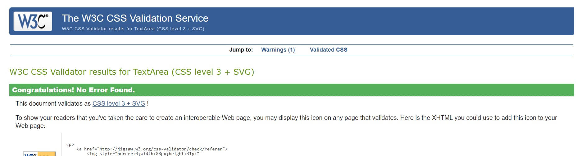

# Word Wise Memory Game - Emma Scott
-------------------------------------

## Introduction
Welcome to my Milestone Project 2. Word Wise is a language-themed memory card game, based on the classic game of Pelmanism. This simple,fun game is designed to test your memory and support the learning of animal names in German. It has been developed with my son in mind, as he is learning German at GCSE level, but is also an enjoyable game for children and adults alike.

The game is based on a deck of 12 cards, placed face down, and the player 'flips' two cards face over each time. The object of the game is to find matching pairs of cards in the least number of moves.

View the live project [here.](https://emmajane22.github.io/memory-game/ "View the Live game here")
___

## Table of Contents
1. [User Experience (UX)](#user-experience-UX)
    1. [Project Goals](#project-goals)
    2. [User Stories](#user-stories)
    3. [Colour Scheme](#colour-scheme)
    4. [Typography](#typography)
    5. [Wireframes](#wireframes)
2. [Features](#features)
    1. [Welcome Page](#welcome-page)
    2. [Game Page](#game-page)
    3. [Congratulations Modal](#congratulations-modal)
    4. [404 Error Page](#404-error-page)
    5. [Future Features](#future-features)
3. [Technologies Used](#technologies-used)
    1. [Languages Used](#languages-used)
    2. [Frameworks, Libraries and Programs Used](#frameworks-libraries-and-programs-used)
4. [Testing](#testing)
    1. [Testing User Stories](#testing-user-stories)
    2. [Code Validation](#code-validation)
    3. [Accessibility](#accessibility)
    4. [Tools Testing](#tools-testing)
    5. [Manual Testing](#manual-testing)
5. [Bugs & Fixes](#bugs-&-fixes)
6. [Deployment](#deployment)
    1. [GitHub Pages](#github-pages)
7. [Credits](#credits)
    1. [Content](#content)
    2. [Media](#media)
8. [Acknowledgements](#acknowledgements)

___

## User Experience (UX)

### Project Goals
* To present a fun, engaging game. 
* To present a clean, clear interface that is easy to navigate between the rules, the game and replaying the game.
* To incorporate a move counter to provide the user with feedback.
* To incorporate sound which provides the user with feedback for correct and incorrect choices.
* To enable the user to be able to replay the game infinite times, with the cards being in different positions.
* To provide responsive design for different sized devices.

### User Stories
* As a player, I want the game to be fun and engaging.
* As a player, I want to be able to read the rules of the game.
* As a player, I want to be able to easily navigate to the game and back to the rules if necessary.
* As a player, I want to know if the two cards chosen are a matching pair or not.
* As a player, I want to know how many moves I have used as I play, and at the end of the game.
* As a player, I want to be able to replay the game inifinite times, with the cards in different positions each time.

### Colour Scheme
[Colormind](http://colormind.io/) was used to create a calming, neutral colour scheme that would not distract from the game board.

Following user feedback, a gradient effect was added to the page background to add a bit more interest.

### Typography
The main font used for headings, links and buttons is Caveat, with Cursive as a fall-back font. This is paired with Roboto as a plain font to make the instructions easy to read. Roboto has Sans-Serif as a fall-back font.

### Wireframes
[Balsamiq](https://balsamiq.com/) was used to create wireframes of the game, showing the placement of different elements.

#### Home Page

#### Game Page

#### Result Page

[Back to top](#table-of-contents)
___

## Features
___

### Welcome Page
    * The website has been designed to be simplistic in appearance.
    * There is a small naviagtion bar at the top of the page, enabling users to nativate easily between the home page and the game.
    * The instructions are on a white section which contrasts with the page background, in order to be visually distinguishable.
    * The blue background has a gradient to give it slightly more interest than a solid background.
    * The speech bubble image features different flags as the game could potentially be expanded in future to cover more than just German vocabulary.
    * The instructions are simple to follow and direct the user to start the game by clicking on the Start button.
    * The start button scales up to give the user feedback when it is clicked.

### Game Page
    * The game page features the same colour scheme for consistency.
    * It has the same small navigation bar at the top of the page, enabling users to easily naviagate back to the instructions or restart the game.
    * The links have a hover feature which causes them to change from black to white when the user hovers their cursor over them.

 

### Score Area
    * Directly underneath the title, there is a move counter, giving the user immediate feedback on the number of moves they have made.
    
* #### Game Area
    * The memory card backs feature the German flag. This was chosen with the potential of future features using different flags for different languages.

      

* The front face of the cards feature an animal and the animal's name in English on one card and German on the matching card.
    
* After the user has clicked on two cards the game board locks. The cards remain face up if they are a matching pair and a positive upbeat sound plays automatically, giving the user immediate feedback. If the cards do not match, they will flip back to the back face and a negative, low sound plays, indicating the user was not succesful on that turn. The game back then unlocks, allowing the user to chose two more cards.

    
### Congratulations Modal
    * Once all of the cards are matched, a modal overlay pops up with a congratulatory message, including the final move count. This enables users to know what score they could try to beat if they play again.
    * The modal features a Play Again button, which closes the modal and reloads the page, allowing users to play again.
    * The modal will also close if the user clicks around the outside of it.

### Replay
    * When the game page is reloaded, the memory cards shuffle and appear in different locations. This allows the user to play the game again, with the same level of challenge.
        

### 404 Page

[Back to top](#table-of-contents)
___

## Technologies Used

### Languages Used
- HTML5 for the contents and structure of the website.
- CSS3 for the styling.
- JavaScript for the functions.

### Frameworks, Libraries and Programs Used
- [Balsamiq](https://balsamiq.com/) for the wireframes.
- [AmIResponsive](https://ui.dev/amiresponsive) for the mockup.
- [JSHint JavaScript Validator](https://jshint.com/) to validate the Javascript.
- [W3C HTML Validator](https://validator.w3.org/) to validate the HTML.
- [W3C CSS Validator](https://jigsaw.w3.org/css-validator/) to validate the CSS.
- [Google Fonts](https://fonts.google.com/) for the fonts.

[Back to top](#table-of-contents)
___

## Testing

### Testing User Stories
Several members of my friends and family, of varying ages from child to retired,  were asked to manually test the following features:

* As a player, I want the game to be fun and engaging.
    - Everyone who tested the game reported that they enjoyed playing it.
* As a player, I want to be able to read the rules of the game.
    - All users reported that the rules were clear, concise and easy to read without being too verbose.
* As a player, I want to be able to easily navigate to the game and back to the rules if necessary.
    - Everyone reported being able to easily find their way around the game.
    - All hyerlinks were tested and worked correctly.
    - All users reported being able to naviagte back to the rules.
* As a player, I want to know if the two cards chosen are a matching pair or not.
    - Everyone confirmed that the sound effects gave them appropriate feedback on whether the cards were a match.
    - All testers confirmed the sound effects were 100% correct for all moves.
    - All testers confirmed that function to flip mis-matched cards and show matching pairs worked correctly 100% of their moves.
* As a player, I want to know how many moves I have used as I play, and at the end of the game.
    - All users confirmed the number of moves to be accurate.
    - Some users said they found it to be a useful feature to try to beat their own moves on another turn. Some users reported they were not interested by this feature.
* As a player, I want to be able to replay the game inifinite times, with the cards in different positions each time.
    - All testers confirmed that the Start Again button worked as planned, and that the cards positions were randomised every time they played again.
    - Players were asked to play more than twice, with some playing up to ten times, and confirmed the cards were in different positions every time the game was restarted.

### Code Validation
### JSHint JavaScript Validator

All code passed in [JSHint JavaScript Validator](https://jshint.com/).

### W3C Markup Validator
Home page: all code passed in [W3C HTML Validator](https://validator.w3.org/).

Game page: three warnings were present in [W3C HTML Validator](https://validator.w3.org/).

Two warnings relate to headers missing from sections of the page that do not require headings.
  

### W3C CSS Validator
All code passed in [W3C CSS Validator](https://jigsaw.w3.org/css-validator/).

### Accessibility
### Lighthouse

### Tools Testing
### Chrome DevTools
I manually tested the game throughout the process using Chrome DevTools. Coding alert boxes allowed me to test that functions were working during the process. The game was tested on DevToolsto check the responsiveness on different screen sizes during the development process. 

### Manual Testing
The game was tested using the following browsers:
* Chrome
* Microsoft Edge
* Safari

It was tested on the following devices:
* Windows laptop - HP 15a
* Windows PC
* Lenovo Chrome Book
* Samsung S7 mobile phone
* Google Pixel 6 mobile phone
* Samsung Galaxy S20 FE mobile phone
* Apple iPhone 12 mini
* Apple iPad 7th gen.

The game was tested by several members of my friends and family. They all reported that it worked without any functionality or responsivness issues on all devices and browsers. They commented positively on the ease of use, and the clarity of the images, the only exception being on the iPhone mini, who reported that the words were too small to be easily read.  

Feature | Outcome | Pass/Fail  
--- | --- | ---
Home Page | The home page loads as expected | Pass
Navigation Bar | Links are working accurately, hover effect working | Pass
Start Game Button | Link is working accurately, onclick effect working | Pass
Game Board | The game board loads as expected | Pass
Memory Cards | Cards load face down | Pass
Random function | The cards' positions are randomised as expected | Pass
Flip function | Cards have a 3-d flip effect as expected | Pass
Matching Pairs | Matching pairs stay face up | Pass
Mis-matched cards | Mismatched cards flip face down again | Pass
Game Board locked | Board is locked during flip function, unable to click on a third card | Pass
Sound | Correct Sound and Incorrect sound play correctly | Pass
Move counter | The number of moves are incremented correctly and are displayed accurately on both the game board and the feedback overlay| Pass
Overlay modal | This appears as expected when the game is complete, the information on it is accurate | Pass
Play Again button | This reloads the game page as expected, and closes the overlay | Pass
404 page | NEED TO TEST | Pass

[Back to top](#table-of-contents)
___
## Bugs & Fixes
* W3C validator showed an unnecessary forward slash in the image self-closing tags, which I then removed.
* JS Hint showed an unexpected expression within the checkForMatch function, which I changed to an if/else statement.
* Javascript link unnecessary on Home page, so I removed that.  
* DevTools showing an error getting the favicon, which was a simple error with the file path, which I resolved by entering the correct file path.

[Back to top](#table-of-contents)
___

## Finished Product
[Back to top](#table-of-contents)
___

## Deployment
### GitHub Pages
This website was developed using GitPod, which was then committed and pushed to GitHub using the GitPod terminal.

### Deployment
The project was deployed using these steps:

1. Create a repository: Log into GitHub and create a public repository named username.github.io. Make the username your username on GitHub.
2. Go to your repository.
3. On top right click Settings.
4. Scroll down to GitHub Pages. Under source, select none then select main/master branch from the dropdown and press save.
5. The page will be atomatically refreshed and a link will be generated for your live site.

### Cloning
To make a local clone of a Github repository:

1. Within GitHub, navigate to the main page of the repository.
2. Above the list of files, click on the green button entitled 'Code'.
3. If you choose to clone using HTTPS, click on the 'copy' icon to the right of the repository URL to copy the link.
4. Open Gitbash.
5. Change the name of the working directory to the location where you want the cloned directory to go.
6. Type git clone, and then paste the URL that you copied earlier.
7. Press Enter to create your local clone.

[Back to top](#table-of-contents)
___

## Credits

### Content
* Memory Card Game tutorial: https://www.youtube.com/watch?v=ZniVgo8U7ek
* W3Schools: Creating a button as a link: https://www.w3schools.com/html/html_links.asp
* Move counter: StackOverflow - https://stackoverflow.com/questions/64212395/how-do-i-add-a-counter-in-my-javascript-game
* Adding sound effects: https://stackoverflow.com/questions/9419263/how-to-play-audio
* Creating a modal: https://www.w3schools.com/howto/howto_css_modals.asp
* Adding a favicon: https://www.w3schools.com/html/html_favicon.asp

### Media
* Sound Effects from Pixabay

   Images from:  
* Badger: https://pixabay.com/photos/badger-wildlife-animal-nature-6317333/
* Bee: https://pixabay.com/photos/bee-insects-pollinate-fly-257176/
* Deer: https://www.freepik.com/free-photo/red-deer-nature-habitat-during-deer-rut-european-wildlife_16755900.htm
* Fox: https://pixabay.com/photos/fox-animal-wilderness-nature-2597803/
* Frog: https://pixabay.com/photos/frog-animal-pond-water-nature-2525994/
* Owl: https://pixabay.com/photos/owl-bird-perched-5495859/
* Speech bubble: https://www.freepik.com/free-vector/speech-bubble-composition-with-flags
* German flag: https://pixabay.com/vectors/germany-flag-germany-german-flag-1783774/

[Back to top](#table-of-contents)
___

## Acknowledgements
* Thank you to my mentor, Marcel, for helpful feedback, industry insights and recommended tools.
* Thank you to my friends and family for frequent testing and interrogation of their opinions.
* Thank you to the tutors and staff at Code Institute for their support.

[Back to top](#table-of-contents)